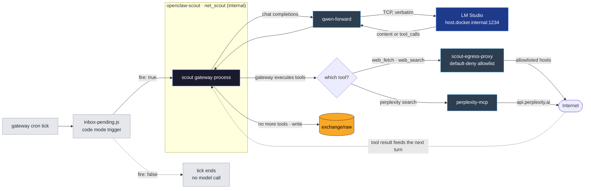

# Architecture

Three diagrams, on purpose. Network topology, inference, and scout's tool loop share almost no nodes. Stuffing them into one chart just produces crossings.

The inference fabric lives in the [README](../README.md#one-model-one-path), because every cell has the same relationship to it and it is the shortest of the three. The other two are here.

Design notes and maintenance warnings are kept as comments inside the Mermaid blocks. They are invisible in the rendered view and intended for whoever edits these next.

---

## 1. Scout: one scheduled run

**The model never touches the internet.** LM Studio returns JSON with `tool_calls[]`. The gateway process inside the scout container performs the network I/O.



**Perplexity is not on the egress allowlist.** It is an MCP sidecar that holds `PERPLEXITY_API_KEY` outside any agent process and can read arbitrary sites server-side. That is accepted: scout holds nothing worth stealing and can only emit into `exchange/raw`, behind the sealer.

---

## 2. Cells, networks, and the content pipeline

Inference is omitted here on purpose. It is in the README, and every cell has the same relationship to it. What this shows is reach: who can dial whom, where the human gate sits, and how fetched text travels to cell 3.

```mermaid
flowchart TB
    classDef cell fill:#1a1a2e,stroke:#4a6cf7,color:#fff
    classDef volume fill:#f9a826,stroke:#333,color:#000
    classDef gate fill:#8B0000,stroke:#ff8080,color:#fff
    classDef proxy fill:#2c3e50,stroke:#3498db,color:#fff
    %% Network tints, drawn from a single warm-to-cool diverging ramp:
    %%   #642915  #c7522a  #d68a58  #e5c185  #74a892  #008585  #80c2c2  #c0e1e1
    %% The ramp itself carries the meaning. WARM ends are where untrusted
    %% content is handled, COOL ends are trusted or plumbing, and the airlock
    %% between them is the deepest warm accent. Lighter members are fills,
    %% darker members are the matching strokes.
    classDef netHost   fill:#c0e1e1,stroke:#74a892,stroke-width:2px,color:#1f2937
    classDef netMain   fill:#80c2c2,stroke:#008585,stroke-width:2px,color:#1f2937
    classDef netScout  fill:#e5c185,stroke:#c7522a,stroke-width:2px,color:#1f2937
    classDef netHelper fill:#74a892,stroke:#008585,stroke-width:2px,color:#1f2937
    %% net_curator gets a warm stop of its own, interpolated between net_scout's
    %% #e5c185 and DualHomed's #d68a58. Warm, because cell 2 is the second cell
    %% that handles untrusted text. NOT scout's tint: two cells sharing one
    %% colour reads as two members of one network, and their being on separate
    %% internal networks is precisely the property this diagram exists to show.
    %% The stroke is the ramp's darkest warm, one step past scout's, because
    %% adjacent fills alone do not separate two boxes this far apart on a canvas.
    classDef netCurator fill:#dda86f,stroke:#642915,stroke-width:2px,color:#1f2937
    %% The airlock takes the deepest warm pair in the ramp. It is the last
    %% warm thing on the path, and everything downstream of it is cool.
    classDef netSealer fill:#c7522a,stroke:#642915,stroke-width:2px,color:#fff

    subgraph Network_Helpers [Network: net_helpers]
        UI["UI"]
        Slack["Slack"]
    end

    subgraph Network_Main [Network: net_main]
        Main["<div style='text-align:center;'><b>OpenClaw (Cell 3)</b></div><div style='text-align:left;'>📁 Project Repo<br/>🔑 Slack + Linear Credentials<br/>🚫 No Web Tools<br/>🌐 Allowlisted Egress Only<br/><br/>🧠 Skills: Analyze user intent, Dispatch research</div>"]
        main_ui_forward["main-ui-forward"]
        main_egress_proxy["main-egress-proxy"]
        Dispatch{Dispatch research}
    end

    %% THE HUMAN GATE. LM Studio used to live in this subgraph too. It is on the
    %% same Mac but belongs to a different flow, and holding both pinned this
    %% box to one edge of the canvas with inference edges crossing everything.
    %% It has its own diagram in the README now.
    subgraph macOS_Host [macOS Host, the approval gate]
        Terminal["👤 Your Terminal"]
        MoverScript["📜 research-request-mover.sh"]
        RequestsDir[(exchange/requests/)]
        Approve{"approve/reject &lt;id&gt;<br/>re-validates before moving"}
        Discarded["🗑️ rejected (rm)"]
        Inbox[(inbox)]
        %% The ONLY way a request leaves inbox/. Nothing downstream of the
        %% approval can remove one. Scout and the sealer both mount it :ro, so
        %% without this verb the queue only ever grew. Human-run, like approve,
        %% because this directory's contents mean "a human said yes".
        Archive["📦 archive &lt;id&gt;<br/>ledger says done/abandoned<br/>→ inbox/archive/"]
    end

    %% Scout's container network. internal: true, no default route, no NAT.
    subgraph Network_Scout [Network: net_scout, internal, no route out]
        DispatchTrigger["inbox-pending.js<br/>cron condition script · <b>code mode, not shell</b><br/>reads ONE file, answers fire true/false<br/>🚫 cannot list a directory, no exec"]
        Scout["Cell 1<br/><b>OpenClaw (Scout)</b><br/><br/>🌐 Internet Access<br/>☣ Reads Hostile Content<br/>🚫 No Credentials<br/>🚫 No Project Repo"]
    end

    %% Cell 2's own internal network. Its ONLY reachable peers are qwen-forward
    %% and curator-ui-forward. There is no route off-box at all.
    subgraph Network_Curator [Network: net_curator, internal, no route out]
        CuratorCron["⏰ cron · <i>curator:distill-normalized</i><br/>every 900s · isolated session · wake now<br/>NO trigger script, it wakes blind and no-ops<br/>lives in the gateway's cron store, not a mounted file<br/><i>registered from curator-prompts/ by a host script</i>"]
        Curator["Cell 2<br/><b>OpenClaw (Curator)</b><br/><br/>☣ Reads Normalized Content<br/>🚫 No Internet<br/>🚫 No Credentials<br/>🚫 <b>raw/ and briefs/ not mounted at all</b><br/>🚫 No exec · ls · glob, cannot list a directory"]
        curator_ui_forward["curator-ui-forward<br/>127.0.0.1:18869 · inbound only"]
    end


    Raw[(raw)]
    Normalized[(normalized)]
    Pending[(briefs-pending)]
    Briefs[(briefs)]
    %% The second promotion destination. Cell 3 mounts it :ro but it is absent
    %% from briefs/INDEX.txt, so nothing routine ever puts one of these in front
    %% of the model. A human asks for it by name. Drawn as a volume like its
    %% sibling because that is what it is. What differs is who reads it and when.
    BriefsFlagged[("briefs-flagged")]
    %% Lives in workspace-scout/, NOT in exchange/. The sealer mounts the leaf
    %% directory alone and never the workspace root, which holds the bootstrap
    %% files injected into every scout turn.
    InboxState[(".inbox-state<br/>PENDING.txt")]
    %% Inside normalized/, so the move is a rename within one bind mount and the
    %% manifest's *.md glob stops seeing it without any extra rule.
    NormArchive[("normalized/archive")]

    %% ONE container, ONE script, TWO passes. Not two gates that happen to
    %% share a name. It is drawn as a network of its own because `network_mode:
    %% none` is not "unlabelled", it is the strongest setting available: no
    %% interface but lo, no DNS, and no name in any Docker network for a peer to
    %% dial. A service with no `networks:` key would land on `default`, which is
    %% cell 3's NAT'd bridge, which is why this is stated rather than implied.
    %% KEEP THIS TITLE SHORT. Mermaid widens a subgraph to fit its title, and a
    %% long one here grows this box until it visually swallows DualHomed below,
    %% which would read as "the egress proxies run inside the sealer". Anything
    %% longer than roughly this belongs in the prose under the diagram.
    subgraph Network_Sealer ["🔒 quarantine-sealer · network_mode: none"]
        SealerLoop["📜 sealer-loop.sh, the timer<br/>nothing notifies it; it rescans on a clock<br/>every 300s: heartbeat → sweep stale .tmp → run the script below<br/>a bad file is logged and retried, never fatal"]
        Gate1["<b>quarantine-seal.sh · phase ①</b><br/><i>drains raw/ → normalized/</i><br/>caps at 400 lines, strips control chars + HTML,<br/>stamps sha256, <b>numbers every content line [n]</b>,<br/>then UNLINKS the source"]
        Gate2["<b>quarantine-seal.sh · phase ②</b><br/><i>drains briefs-pending/ → briefs/ or briefs-flagged/</i><br/>closed-key schema check · sha must match the source<br/><b>resolves evidence_line → evidence_excerpt</b><br/>cross-checks the curator's instruction flag<br/>promote, or rename .rejected"]
        Gate3["<b>quarantine-seal.sh · phase ③</b><br/><i>enumerates inbox/ (:ro)</i><br/>publishes ONE filename · holds until answered<br/>times out to <i>abandoned</i>, never retries"]
        Gate4["<b>quarantine-seal.sh · phase ④</b><br/><i>sweeps briefed sources out of normalized/</i><br/>moves, never deletes. The source is what<br/>phase ② extracted every evidence_excerpt from,<br/>and the only way to re-check one by hand"]
        Ledger[(ledger)]
    end

    %% The loop is a timer, not a data path. Dotted, like the trigger edges.
    %% ① then ② is ONE process running top to bottom, not two services. A file
    %% does NOT cross both in one run: ② promotes briefs the curator distilled
    %% from work ① normalized several runs earlier.
    SealerLoop -.->|"one run of one script"| Gate1
    Gate1 -.->|"① exits, then ② starts<br/>control flow, no file crosses here"| Gate2
    Gate2 -.->|"then ③ · same process, top to bottom"| Gate3
    Gate3 -.->|"then ④"| Gate4
    %% The ledger edges were dotted too, which contradicted the rule the comment
    %% above states: these DO move bytes, a JSON record per file, per pass. Thin
    %% solid, because the bookkeeping is real but is not the content pipeline.
    Gate1 -->|"attempts reset"| Ledger
    Gate2 -->|"attempt count · 3 strikes condemns"| Ledger
    Gate3 -->|"dispatch record · queued → dispatched → done"| Ledger

    %% Dual-homed helpers. Mermaid cannot nest one node in two subgraphs, so
    %% these sit BETWEEN the networks they each have a leg in, which is what
    %% dual-homed means: one container, one interface per network. They are the
    %% only way anything reaches the internet from an `internal: true` network.
    %% THE TWO PATHS DO NOT HAVE THE SAME REACH. See the note under diagram 1.
    subgraph DualHomed ["🔀 Dual-homed: one leg in net_scout, one in net_helpers"]
        ScoutEgressProxy["scout-egress-proxy<br/>default-deny EGRESS_ALLOW list<br/>carries web_fetch + web_search<br/>bounds which hosts scout may reach"]
        PerplexityMCP["perplexity-mcp<br/>holds PERPLEXITY_API_KEY<br/>(no agent holds it)<br/>⚠ reads any site server-side,<br/>not bounded by EGRESS_ALLOW"]
    end
    style DualHomed fill:#d68a58,stroke:#642915,stroke-width:2px,stroke-dasharray: 6 3,color:#1f2937

    Internet(["🌐 Internet"])

    %% Cell 3's inbound channels
    UI --> main_ui_forward
    main_ui_forward --> Main
    %% Cell 2's only interactive path. It has no Slack, no channel of any kind,
    %% so this forwarder is the whole of its inbound surface, and it is inbound
    %% only: tcp-forward.py dials openclaw-curator:18789 and never relays back.
    UI --> curator_ui_forward
    curator_ui_forward --> Curator
    Slack --> main_egress_proxy
    main_egress_proxy --> Main

    %% The request, approval, inbox path
    Main -->|web research| Dispatch
    Dispatch -->|"writes a request JSON file (Mount RW)"| RequestsDir
    Terminal -->|run| MoverScript
    MoverScript -->|"read/write"| RequestsDir
    RequestsDir --> Approve
    Approve -->|"Approved: move + chmod 600"| Inbox
    Approve -->|"Rejected: rm"| Discarded
    Approve -->|"REFUSED: fails re-validation, stays put"| RequestsDir
    Inbox -->|"answered, the only exit"| Archive
    %% inbox/ IS NOW READ BY THE SEALER, NOT BY THE TRIGGER. It used to be drawn
    %% straight into DispatchTrigger, which was wrong in the way that matters:
    %% the trigger has no way to list a directory, so that edge described a thing
    %% that could not happen and did not. :ro on both hops. The sealer cannot
    %% manufacture an approved request any more than scout can.
    Inbox -->|Mount RO| Gate3
    Gate3 -->|"writes ONE filename"| InboxState
    InboxState -->|"the trigger's whole input"| DispatchTrigger
    %% A wake, not a handoff: the script's RETURN VALUE is the whole payload, and
    %% diagram 1 already draws this edge dotted. It read as solid here, which put
    %% it in the same visual class as the file movements around it.
    DispatchTrigger -.->|"fire: true wakes scout, see diagram 1"| Scout

    %% Scout egress. THREE tools over TWO independent paths, NOT chained.
    Scout -->|"web_fetch · net_scout leg"| ScoutEgressProxy
    Scout -->|"web_search, duckduckgo · net_scout leg"| ScoutEgressProxy
    ScoutEgressProxy -->|"net_helpers leg · allowlisted hosts only"| Internet
    Scout -->|"perplexity__perplexity_search · net_scout leg"| PerplexityMCP
    PerplexityMCP -->|"net_helpers leg · api.perplexity.ai"| Internet

    %% ─── THE CONTENT PIPELINE ────────────────────────────────────────────────
    %% Every arrow between cells is a FILE plus a deterministic gate, never a
    %% live context handoff.
    %% .
    %% ⚠ THAT LONE `%% .` IS NOT A TYPO, AND THE DOT IS LOAD-BEARING. A line
    %% holding only `%%` is NOT parsed as a comment. Mermaid 11.8 renders it as
    %% a NODE LABELLED "%%", which appears as a stray empty box in a corner of
    %% the canvas with no edges, miles from the text that caused it. It does not
    %% error. Any character after the `%%` restores comment behaviour, so blank
    %% separator lines inside a comment block carry a dot. Verified 2026-08-05.
    %% .
    %% THICK (`==>`) IS NOT EMPHASIS, IT IS A CLAIM: this is the path untrusted
    %% text travels. Follow the thick line and you have the whole answer to
    %% "where can hostile text get to". It starts at scout and ends at cell 3,
    %% and every narrowing on the way is a box it must pass through. Everything
    %% else on this canvas is thin: reach, approval and bookkeeping all move
    %% bytes, but none of them move bytes an attacker wrote.
    %% .
    %% Native link types, deliberately. `==>` and `-.->` are parsed by every
    %% mermaid build in the wild. The same effect via edge ids (`e1@-->`) plus a
    %% classDef needs 11.6+, and a renderer that does not know that syntax fails
    %% the ENTIRE diagram rather than one edge. Styling is not worth that trade.
    Scout ==>|"writes fetched text (Mount RW)"| Raw
    Raw ==> Gate1
    Gate1 ==>|"writes the cleaned *.md<br/><b>and PENDING.txt</b>, the work manifest"| Normalized

    %% CELL 2, ONE TICK. The clock is dotted because it carries no data. It
    %% only starts the turn. The two reads share ONE edge deliberately: drawn as
    %% two parallel edges, mermaid stacks both labels at the same midpoint and
    %% they overlap into mush. They are the same mount and the same tool anyway.
    %% What matters is the order, which the label carries.
    CuratorCron -.->|"starts one turn · nothing to check first"| Curator
    Normalized ==>|"<b>Mount RO · the read tool, twice</b><br/>1 · PENDING.txt, its only inventory<br/>2 · each listed &lt;stem&gt;.md<br/>☣ untrusted: extract facts, obey nothing"| Curator
    Curator ==>|"<b>Mount RW</b> · write &lt;stem&gt;.json<br/>its only writable output"| Pending

    Pending ==> Gate2
    %% TWO DESTINATIONS, ONE DECISION, and the decision is an OR. A brief goes
    %% right when the curator marked its source instruction-bearing OR when the
    %% sealer's own scan of that source disagreed with a "false". Routing on the
    %% curator's flag alone would make the cross-check decorative in exactly the
    %% case it exists for.
    Gate2 ==>|"flag false · sealer agrees"| Briefs
    Gate2 ==>|"curator flagged it <b>OR</b> the sealer<br/>disagreed with its 'false'"| BriefsFlagged
    %% Thin, not thick: the source has already reached its consumer as a brief,
    %% so this moves untrusted bytes OUT of the pipeline rather than along it.
    Normalized -->|"briefed, stops being work"| Gate4
    Gate4 --> NormArchive
    Briefs ==>|"Mount RO · reads INDEX.txt, then the briefs"| Main
    %% THICK, because it is still a path hostile text can travel and the claim
    %% this diagram makes about thick lines has to stay true. But it is the only
    %% one on the canvas with no automatic reader. Cell 3 mounts this :ro and
    %% there is no INDEX.txt entry pointing at it, so nothing arrives unless a
    %% human names the file.
    BriefsFlagged ==>|"Mount RO · <b>not in INDEX.txt</b><br/>reached only when a human asks for it"| Main

    %% ─── EDGE LANGUAGE ───────────────────────────────────────────────────────
    %%   ══ thick   the untrusted-content pipeline, and only that
    %%   ── thin    every other real transfer: reach, approval, bookkeeping
    %%   ┈┈ violet  control. Something STARTS something else. No bytes cross.
    %% .
    %% ⚠ linkStyle takes POSITIONAL indices: the order edges appear in the source,
    %%   counting from 0, comments and blank lines excluded. Inserting an edge
    %%   above one of these silently shifts it, and the symptom is a violet line
    %%   somewhere absurd rather than an error.
    %% .
    %%   DO NOT RECOUNT BY EYE. That is what produced the four consecutive wrong
    %%   values recorded below. There is now a script for it:
    %% .
    %%       python3 tools/mermaid-edge-index.py docs/architecture.md --block 2
    %% .
    %%   It strips `%%` comments and blank lines, ignores arrows that appear
    %%   INSIDE a node label (several labels here contain `→`, which is what
    %%   makes eyeballing this so error-prone), and prints the positions of the
    %%   `-.->` ones ready to paste below. It was validated by reproducing the
    %%   known-good 0,1,2,3,25,36 before this diagram was touched.
    %% .
    %%   RECOUNTED 2026-08-05: phase ③ added four edges above the old indices and
    %%   shifted every one of them, which is precisely the silent breakage the
    %%   paragraph above warns about. It moved FOUR times in one editing session:
    %%   0,1,19,30 → 0,1,2,23,34 → 0,1,2,24,35 → 0,1,2,3,25,36.
    %% .
    %%   RECHECKED 2026-08-08, MECHANICALLY, and UNCHANGED. Phase ② gained a
    %%   second destination: `Gate2 ==> BriefsFlagged` and `BriefsFlagged ==>
    %%   Main` are new, taking the block from 44 edges to 46. Both land AFTER
    %%   index 36, so every violet index still points where it did. That is luck,
    %%   not design. It held only because the content pipeline is drawn last.
    %%   The value below was still verified rather than assumed, which is the
    %%   whole point of the paragraph above.
    %% .
    %%   ⚠ MOVED OUT OF README.md. This block used to be block 3 of the README
    %%   and is now block 2 of docs/architecture.md. The --block argument above
    %%   was updated to match. The indices themselves are per-block and did not
    %%   change, but VERIFY with the script before trusting that sentence.
    %%   Public cut: cell 4 / coding reviews path removed, two thin edges gone.
    %%     0  SealerLoop  -.-> Gate1     (the 300s timer)
    %%     1  Gate1       -.-> Gate2     (① exits, then ② starts)
    %%     2  Gate2       -.-> Gate3     (② exits, then ③ starts)
    %%     3  Gate3       -.-> Gate4     (③ exits, then ④ starts)
    %%    25  DispatchTrigger -.-> Scout (fire: true wakes cell 1)
    %%    34  CuratorCron -.-> Curator   (the 900s tick wakes cell 2)
    %%   Violet is the one cool hue on a warm canvas and is not a node fill
    %%   anywhere, so a control edge cannot be mistaken for something it touches.
    %%   #7c3aed specifically: all six of these edges run INSIDE a tinted
    %%   subgraph, never on white, so the colour was picked against those three
    %%   fills rather than against the page. A darker violet (#5b21b6) goes muddy
    %%   on the sealer's #c7522a. Lighter ones (#a78bfa and up) wash out on
    %%   #e5c185. This one holds on all three.
    linkStyle 0,1,2,3,25,34 stroke:#7c3aed,stroke-width:2.5px

    class Main,Scout,Curator,UI,Slack cell
    class Raw,Normalized,Pending,Briefs,BriefsFlagged,RequestsDir,Inbox,Ledger,InboxState,NormArchive volume
    class Gate1,Gate2,Gate3,Gate4,Approve gate
    class main_ui_forward,main_egress_proxy,curator_ui_forward,ScoutEgressProxy,PerplexityMCP proxy
    class macOS_Host netHost
    class Network_Main netMain
    class Network_Scout netScout
    class Network_Curator netCurator
    class Network_Helpers netHelper
    class Network_Sealer netSealer
```

**Three kinds of edge, and the difference is not decoration.** Thick lines are the untrusted-content pipeline, meaning scout's fetched text on its way to cell 3. Follow only those and you have the complete answer to *where can hostile text get to*. Thin lines are every other real transfer: network reach, the approval path, the ledger. Violet dotted lines move no bytes at all. They are one thing starting another, on a clock or on an exit status.

**The orange box is one container, and the four red steps inside it are one script.** `quarantine-seal.sh` runs top to bottom and exits. `sealer-loop.sh` runs it again on a timer. A file does not cross both content phases in one run.