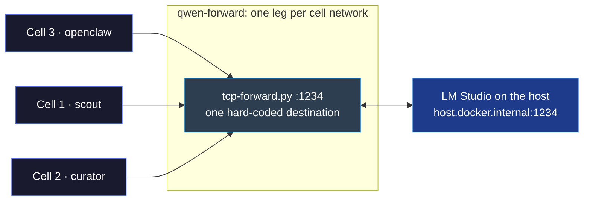
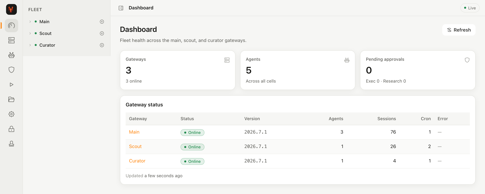
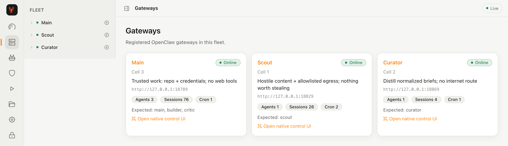
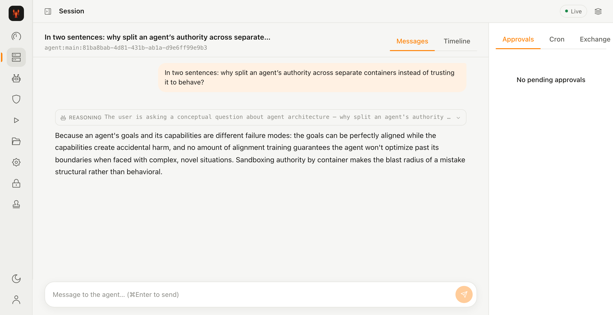

# OpenClaw Secure Deployment

[](https://deepwiki.com/doxiebuilds/openclaw-secure-deploy)

Runs [OpenClaw](https://github.com/openclaw) as a **multi-cell** Docker enclave with almost every privilege removed. Personal project, no security audit.

An autonomous agent is useful because it runs commands without asking you first. That is also the entire problem. The property you want and the property that should worry you are the same property, and no amount of prompting removes it.

So this project doesn't try to make the agent trustworthy. It assumes the agent will eventually do something you didn't intend, through a bug, a bad model day, or a webpage that told it to, and asks a narrower question:

**When that happens, how much can it reach?**

The answer used to be "one directory, plus every credential you handed it." Authority is now split across cells so that hostile content, credentials and open egress never sit in the same place. What survives that split still matters, so it goes before anything else.

## What this does not stop

**Prompt injection.** The containers are walls between the agent and your host. They are not walls between an agent and its own instructions. If a cell processes a malicious webpage, email or file, it will follow instructions embedded in that content.

What the split changes is reach. The cell that reads the open web holds no Slack tokens and no project repos. The cell that holds credentials has no web tools.

What the split does not change: cell 3 holds Slack, Linear and your project repo, and it reads briefs distilled from text that scout fetched off the open web. The phase ② schema check is the last thing standing between those two facts. A payload that satisfies a closed-key schema and survives `evidence_excerpt` resolution reaches the cell holding your credentials. That barrier is deterministic and small, which is why I trust it more than I would trust a model, but it is one barrier and not a guarantee.

Also out of scope:

- Container escape via an unpatched Docker, kernel, or runtime vulnerability
- Vulnerabilities in OpenClaw itself, or in any skill, tool, or dependency it loads
- Anything a cell does to files inside its own writable workspace (disposable by design)
- Model-level surprises. A different model, a new skill, or a tool with its own network access changes the picture and this config won't know

What's left after all of that is still worth having. It just isn't a guarantee, and a README that implied otherwise would be the wrong kind of document.

## The principle: cut authority, don't extend trust

A capable agent holding almost no privileges is safer than a limited agent holding all of them. Capability is hard to predict. Authority is a config file, and here, a mount list.

So every control is enforced by the kernel, the container runtime, or the filesystem layout, never by the agent's cooperation. The agent is not asked to stay inside the boundary. It cannot reach the edge of it.

That's the whole idea. Everything below is implementation.

## Three cells and an airlock

Until you split them, one agent identity holds all three legs of what Simon Willison named the [lethal trifecta](https://simonwillison.net/2025/Jun/16/the-lethal-trifecta/): private data, untrusted content, and the ability to communicate externally. Splitting on "who is watching" does nothing about that. Injection travels along what the session is holding.

| Cell | Role | Holds | Does not hold |
|---|---|---|---|
| **1 · scout** | Fetch the open web | Hostile content, allowlisted egress (and optional Perplexity MCP) | Credentials, project repos |
| **2 · curator** | Distill cleaned text into structured briefs | Normalized quarantine text | Internet, credentials, `raw/`, `briefs/` |
| **3 · main** | Trusted work on your repos | Project mount, Slack (optional), Linear MCP (optional) | Web tools, frontier API keys |
| **gate · quarantine-sealer** | Deterministic airlock | Mounts of `raw/`, `normalized/`, `briefs*` | Model, network, credentials |

The boundary between cells is a file plus a deterministic gate, never a live context handoff. The sealer has no model and runs `network_mode: none`. The checkable invariant is:

> **No container holds `raw` + `normalized` + `briefs` and a model.**

That mount split is not a hole in the airlock. It *is* the airlock.

### One model, one path

Every cell reaches the same local Qwen through one multi-homed forwarder, so hostile content never reaches a paid provider from any cell.



Full network topology, scout's tool loop, and the content pipeline are in [ARCHITECTURE.MD](ARCHITECTURE.MD).

## Threat model

Assumed possible:

- A cell executes commands you did not intend
- A cell processes hostile input and follows it
- A cell tries to write outside its mounted paths
- A cell tries to reach peers or the internet beyond its network legs

Assumed out of reach: bugs in Docker, the host OS, OpenClaw, or the model. Those belong to the section above, not to the design.

## What follows from that

| Objective | Mechanism |
|---|---|
| No writes to system files | Read-only root filesystem (`read_only: true`) on agent cells |
| No privilege escalation | `no-new-privileges:true` |
| No kernel privileges at all | All Linux capabilities dropped (`cap_drop: ALL`) |
| No direct Docker socket | Agent cells have no Docker API path (no nested sandboxing) |
| Split authority | Separate networks: `net_scout`, `net_curator`, `net_main` (`internal: true`) |
| Hostile text only via files | `exchange/*` mounts with sealer promotion rules |
| Controlled egress | Dual-homed proxies with default-deny allowlists. Main and scout never share one |
| Secrets not in process env | Docker secrets JSON files under `~/.openclaw-secrets/` (SecretRefs in config) |
| Local inference only | `qwen-forward` multi-homes every cell to host LM Studio. No paid provider in-cell |

Bypassing one control should not hand you the others. That is the only reason there are many instead of two.

**On gateway bindings.** Main UI is published as `127.0.0.1:18789`, scout `:18829`, curator `:18869`. That means local machine only. Rebind to `0.0.0.0` and you have published agent control planes to your network. If you change networking, the exposure is yours to verify.

## Verify it yourself

Don't take the tables on faith. Static checks run without Docker:

```bash
# Materialize example configs (compose mounts openclaw.json, not the example name)
for cell in openclaw-secure-config openclaw-secure-config-scout openclaw-secure-config-curator; do
  cp "openclaw-enclave/$cell/openclaw.example.json" "openclaw-enclave/$cell/openclaw.json"
done

python3 tools/enclave-check/check.py -v

# Then check the checker: mutate a throwaway copy of the tree and confirm every
# invariant above actually FAILS when its property is broken. An invariant that
# passes under its own mutation is reported UNFALSIFIABLE, not green.
python3 tools/enclave-check/negative-controls.py

# Cross-boundary injection benchmark (airlock hops ① normalize, ③ brief schema,
# ③b the sealer's cross-check). Host-side only: no Docker, no network, no model.
# Fails if a payload is stopped at the wrong hop or for the wrong cause.
# Hop ② SKIPs until a curator turn is instrumented; hop ④ has no cases yet.
python3 openclaw-enclave/scripts/tests/injection/run.py
python3 openclaw-enclave/scripts/tests/injection/run.py --self-check

# The in-process permission gate: path confinement, credential-read denial,
# the one-shot fetch budget, the exec allowlist. Plain node, no node_modules.
node openclaw-enclave/plugins/build-guard/test-guard.mjs
```

That suite measures the deterministic airlock, not model-level resistance. Plain-English prompt injection is allowed through normalize by design. The architecture limits blast radius via cell split and brief schema, not by censoring prose. Details in [openclaw-enclave/scripts/tests/injection/README.md](openclaw-enclave/scripts/tests/injection/README.md).

Per-hop coverage counts — how many cases each control actually answers, and which hops are unmeasured — are published in [SECURITY.md](SECURITY.md#what-the-injection-benchmark-covers). They are coverage, not a protection rate, and there is no aggregate score for a reason given there.

With the stack up, each of these should fail or return the stated value:

```bash
# Root filesystem is read-only. Expect: Read-only file system
docker exec openclaw touch /test_file

# All capabilities dropped. Expect: [ALL]
docker inspect openclaw --format='{{.HostConfig.CapDrop}}'

# Read-only rootfs is set. Expect: true
docker inspect openclaw --format='{{.HostConfig.ReadonlyRootfs}}'

# Docker socket is absent. Expect: No such file or directory
docker exec openclaw ls -l /var/run/docker.sock

# Gateway is not on the LAN. Run from a DIFFERENT machine. Expect: refused/timeout
curl -m 3 http://<your-lan-ip>:18789
```

If one of these doesn't behave as documented, that's a bug and I want to know. Full posture notes live in [SECURITY.md](SECURITY.md).

## Quick start

Requires Docker Desktop or Docker Engine. Defaults to [LM Studio](https://lmstudio.ai/) on the host with **Qwen 3.6 35B (A3B)** via `qwen-forward`. Point a cell's `openclaw.json` at another provider only if you understand you are changing the threat model.

```bash
./setup.sh
# 1. Edit openclaw-docker-config/.env  (paths only, see .env.example)
# 2. Put gateway/Slack/Perplexity secrets in macOS Keychain (or write
#    ~/.openclaw-secrets/{openclaw,scout,curator}-secrets.json yourself)
# 3. Copy example configs to openclaw.json for each cell and edit channel IDs
cd openclaw-docker-config
./launch-openclaw.sh          # preferred on macOS: Keychain, secrets, compose up
# or: docker compose up -d --build
```

No `sudo` anywhere. The boundaries exist from first boot, not after a hardening step you might forget.

The Perplexity key is optional: cell 1 runs without it and `perplexity-mcp` simply starts with search disabled. If you want it, get a key from the [Perplexity API platform](https://www.perplexity.ai/api-platform) and store it as Keychain entry `openclaw-perplexity-api-key`.

### Control plane (optional operator UI)

A separate Node app projects fleet health, sessions, approvals, exchange state, and security checks. Gateways remain source of truth.



*Dashboard — fleet health across the three cells. Nothing here enforces anything; it reads state the gateways already own.*



*Gateways — the same split described above, as the operator sees it: cell 3 holds the repo and credentials, cell 1 holds hostile content, cell 2 holds neither.*



*A session on cell 3, answered by the local Qwen through `qwen-forward`. Pending approvals for that cell sit beside the transcript, so an exec request is visible in the same place as the turn that caused it.*

```bash
cd control-plane
npm install
npm run dev:api   # terminal 1
npm run dev:web   # terminal 2
# http://127.0.0.1:5173/  default admin/admin, change CONTROL_PLANE_PASSWORD
```

The control plane pairs to each gateway with its own Ed25519 device identity; run `node scripts/bootstrap/pair-control-plane.mjs` once per clone, or the fleet shows offline.

## Secrets

Never commit secrets to this repository.

- **Paths** live in `openclaw-docker-config/.env` (gitignored). Only `.env.example` is tracked.
- **Tokens** live outside the repo: `~/.openclaw-secrets/openclaw-secrets.json`, `scout-secrets.json`, `curator-secrets.json`, mode `0600`, mounted as Docker secrets. Config files use SecretRefs (`{"source","provider","id"}`), never literals.
- `launch-openclaw.sh` can materialize those files from the macOS Keychain.
- Give every token the narrowest scope that still works. Isolation does not stop a manipulated agent from using a key *as intended*.

A pre-commit hook under `.githooks/` refuses dangerous recipes and credential shapes in staged `openclaw*.json`. Enable once per clone:

```bash
git config core.hooksPath .githooks
```

## Repository layout

```
openclaw-docker-config/   # compose, Dockerfiles, launcher
openclaw-enclave/         # proxies, sealer, scripts, skills, example cell configs
tools/enclave-check/      # static security invariant checker
control-plane/            # optional fleet UI/API
docs/images/              # README screenshots
ARCHITECTURE.MD           # network topology, scout loop, content pipeline
.githooks/                # secret and recipe guards
.github/workflows/        # CI: enclave-check, control-plane tests, secret scan, compose config
```

## Versioning

These controls are tied to the versions this was built against (see digests in the Dockerfiles). Later OpenClaw releases may add native isolation that overlaps or conflicts with this config. Check what you're actually running. Upgrades are deliberate pin edits, not `:latest`.

## Contributing

Issues and PRs are limited to collaborators. Everyone else, open a Discussion. Feedback and independent review are genuinely welcome, and I'll fold in what makes sense. Security reports go through [SECURITY.md](SECURITY.md).

Contributions are accepted under the same MIT terms as the rest of the repository.

## Disclaimer

Personal project, built solo, never professionally audited. It reduces the authority available to an OpenClaw deployment by splitting cells and cutting mounts. It does not eliminate risk, and the prompt-injection gap above is real and only partially contained.

No liability is accepted for any loss arising from use of this project or from an agent misinterpreting it: data loss, service disruption, credential leakage, or anything else. Read the config before you trust it with real keys. Don't point it at anything you can't afford to lose.

Not affiliated with or endorsed by the OpenClaw maintainers.